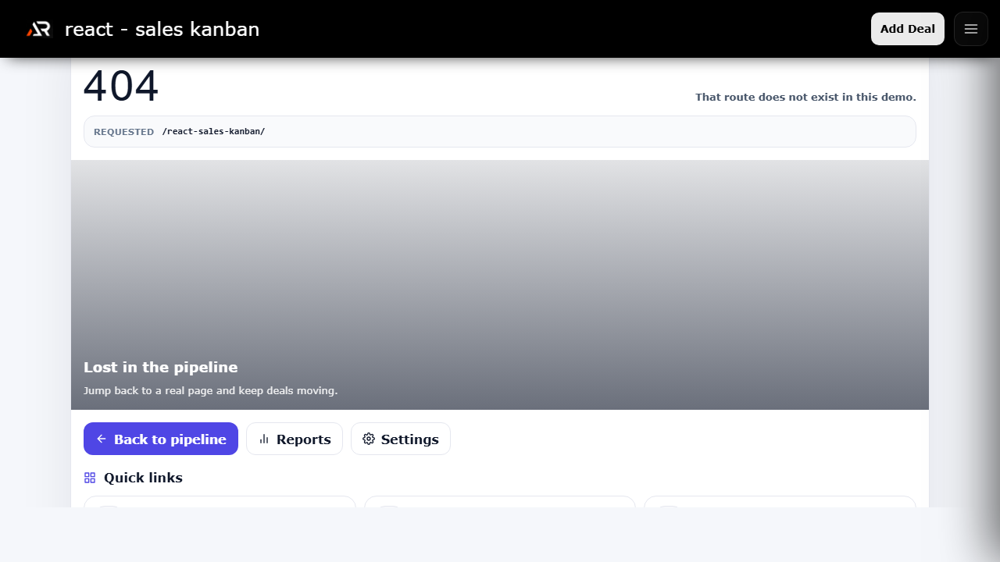

# React Sales Kanban

A focused frontend sales workspace for organizing deals, moving opportunities through a Kanban pipeline, and reviewing forecast summaries.

## Features

- Pipeline board with deal stage movement
- Deal details, reports, and settings routes
- Responsive layout with fixed navigation and mobile menu
- Frontend-only state and reusable React components
- Social, support, and portfolio links in the footer

## Tech stack

React, Vite, React Router, styled-components, Material UI, and React Icons.

## Run locally

\`\`\`bash
npm install
npm run dev
\`\`\`

Create a production build with \`npm run build\`. Deploy to GitHub Pages with \`npm run deploy\`.

## Links

- Portfolio: [ashishranjan.net](https://www.ashishranjan.net/)
- GitHub: [github.com/a2rp](https://github.com/a2rp)
- CodePen: [codepen.io/ash1198](https://codepen.io/ash1198)
- LinkedIn: [linkedin.com/in/aashishranjan](https://www.linkedin.com/in/aashishranjan)
- Facebook: [facebook.com/theash.ashish](https://www.facebook.com/theash.ashish/)
- YouTube: [Ashish Ranjan](https://www.youtube.com/@ashishranjan-ashz?sub_confirmation=1)
- Email: [ash.ranjan09@gmail.com](mailto:ash.ranjan09@gmail.com)

## Support

- [Support](https://a2rp-donation-page.netlify.app/)
- [Buy Me a Coffee](https://buymeacoffee.com/a2rp)
- [Patreon](https://www.patreon.com/a2rp)

## Future improvements

- Add persistent multi-user data
- Add richer reporting filters and export options
