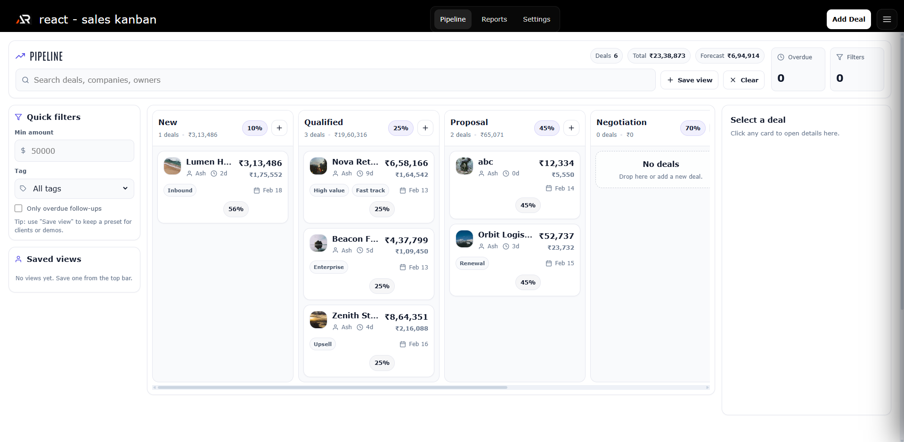

<div align="center">

# react-sales-kanban

A frontend-only Sales Pipeline Kanban demo built in React to manage deals, visualize revenue forecasts, and control pipeline flow.

</div>

---



---

## What this is

react-sales-kanban is a light-theme sales pipeline UI that helps you:

- track deals across structured stages
- move opportunities through a visual board
- calculate weighted revenue forecasts
- monitor aging and follow-up activity
- customize stages and probabilities

This is a frontend-only demo. All data is stored locally and persists between sessions.

---

## Pages

- Pipeline Board - horizontal stage board with drag and drop, totals, and deal inspector panel
- Deal Details - full deal profile with activity timeline, notes, and stage history
- Reports - pipeline summary, forecast metrics, funnel breakdown, aging analysis
- Settings - stage configuration, probability mapping, owners, tags, sample data reset

---

## Key features

- Stage-based pipeline with configurable probability per stage
- Drag and drop deal movement with real-time totals update
- Weighted forecast calculation based on deal amount and stage probability
- Activity timeline with notes and mock interactions
- Aging indicators for stalled deals
- Saved filters and quick views
- Export pipeline data to CSV
- Light theme design with a clean SaaS-style layout

---

## Tech stack

- React with Vite
- styled-components
- React Router
- localStorage for persistence

---

## Local development

```bash
# Install dependencies
npm install

# Start dev server
npm run dev

# Build
npm run build

# Preview build
npm run preview
```

## Links

- Portfolio: [https://www.ashishranjan.net](https://www.ashishranjan.net)
- GitHub: [https://github.com/a2rp](https://github.com/a2rp)
- CodePen: [https://codepen.io/ash1198](https://codepen.io/ash1198)
- LinkedIn: [https://www.linkedin.com/in/aashishranjan](https://www.linkedin.com/in/aashishranjan)
- Facebook: [https://www.facebook.com/theash.ashish/](https://www.facebook.com/theash.ashish/)
- YouTube: [https://www.youtube.com/@ashishranjan-ashz?sub_confirmation=1](https://www.youtube.com/@ashishranjan-ashz?sub_confirmation=1)
- Email: [ash.ranjan09@gmail.com](mailto:ash.ranjan09@gmail.com)

## Support

- Support: [https://a2rp-donation-page.netlify.app/](https://a2rp-donation-page.netlify.app/)
- Buy Me A Coffee: [https://buymeacoffee.com/a2rp](https://buymeacoffee.com/a2rp)
- Patreon: [https://patreon.com/a2rp](https://patreon.com/a2rp)
<!-- Project links -->

## Links

- Live: [https://a2rp.github.io/react-sales-kanban/](https://a2rp.github.io/react-sales-kanban/)
- Repository: [https://github.com/a2rp/react-sales-kanban](https://github.com/a2rp/react-sales-kanban)
- Portfolio: [https://www.ashishranjan.net/](https://www.ashishranjan.net/)
- GitHub: [https://github.com/a2rp](https://github.com/a2rp)
- CodePen: [https://codepen.io/ash1198](https://codepen.io/ash1198)
- LinkedIn: [https://www.linkedin.com/in/aashishranjan](https://www.linkedin.com/in/aashishranjan)
- Facebook: [https://www.facebook.com/theash.ashish/](https://www.facebook.com/theash.ashish/)
- YouTube: [https://www.youtube.com/@ashishranjan-ashz?sub_confirmation=1](https://www.youtube.com/@ashishranjan-ashz?sub_confirmation=1)
- Email: [ash.ranjan09@gmail.com](mailto:ash.ranjan09@gmail.com)

## Support

- Support: [https://a2rp-donation-page.netlify.app/](https://a2rp-donation-page.netlify.app/)
- Buy Me a Coffee: [https://buymeacoffee.com/a2rp](https://buymeacoffee.com/a2rp)
- Patreon: [https://www.patreon.com/a2rp](https://www.patreon.com/a2rp)
